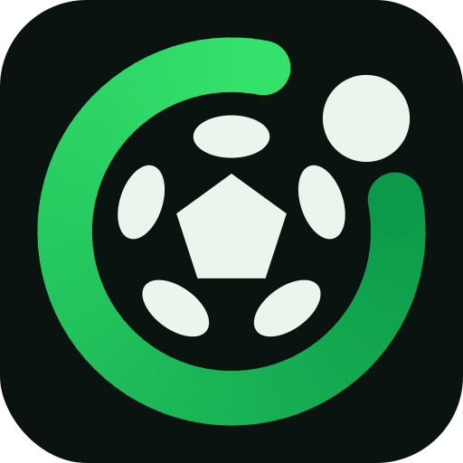
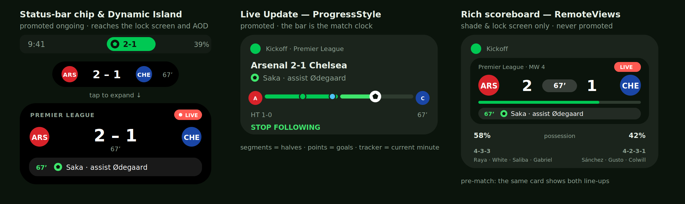

<div align="center">



# matchUP

**Live football on your lock screen, and a game against your mates the rest of the week.**

Android 16 Live Updates · Material 3 · Jetpack Compose · Node backend on Render

</div>

---

matchUP puts a live, self-updating card on your phone from an hour before kick-off until
the final whistle. Before the match it counts down and shows the confirmed line-ups; once
the ball is rolling it carries the score, the match minute, and every goal, card and
substitution as it happens — on the lock screen, in a status-bar chip, and on the
always-on display where the device supports it.

Between matches it is a prediction game: make a group, pick your clubs, call every score
before kick-off, and nobody sees anybody else's guess until the whistle goes.



## What it does

| | |
|---|---|
| **Live match card** | A promoted [Live Update](https://developer.android.com/develop/ui/views/notifications/live-update) whose progress bar *is* the match clock: two 45-minute segments, a marker at the minute of every goal, and the ball tracker sitting on the current minute. Team crests bookend the bar. |
| **Status-bar chip** | The scoreline compressed to seven characters (`2-1`), visible while you use other apps. |
| **Pre-match line-ups** | From T-60, the card shows the countdown and, once the clubs publish them, both starting XIs and formations. |
| **Goal / card / foul alerts** | Goals with scorer and assist, yellows and reds with the player, substitutions, VAR decisions. Each one alerts at most once, whether it arrived by push or by poll. |
| **Dynamic Island** | A pill under the status bar carrying the crests and the score, which springs open into a full match card when tapped. Optionally floats over every other app. |
| **Prediction game** | Groups with an invite code, a guess per fixture locked at kick-off, three points for the exact score and one for calling it right, a table, and a chat with a day of history. Every rule is enforced server-side. |
| **Pre-match read** | Win percentages, both sides' form and the head-to-head, from the provider's own model. There is no expected line-up to show — see below. |
| **Onboarding** | Pick competitions, then favourite teams, then decide what you want to be interrupted for. |
| **Fixtures & teams** | A date-strip schedule, per-competition browsing, team search, and a match screen with a timeline, a drawn pitch with both line-ups, and the stats. |

## The honest part: what Android actually allows

Android forces a choice that iOS does not, and it is worth understanding before you judge
the design.

A **promoted ongoing notification** — Android 16's Live Update — is the only kind of
notification that can appear as a status-bar chip, stay expanded on the lock screen, and
be rendered on an always-on display. To qualify, the notification **must not use custom
`RemoteViews`**. That is a hard eligibility rule, not a limitation of this app.

A **custom scoreboard** with crests, a big scoreline and an event ticker requires
`RemoteViews`, and is therefore *permanently* disqualified from all of those surfaces. It
also never renders on AOD, on any Android version.

So matchUP builds both and picks at post time:

| Setting | What you get | Where it appears |
|---|---|---|
| **Auto** (default) | `ProgressStyle` Live Update, promoted | Shade, lock screen, status-bar chip, AOD where supported |
| **Rich** | Custom scoreboard with crests | Shade and lock screen only — never the chip, never AOD |
| **Plain** | System template | Everywhere, plainly |

**On always-on display specifically:** there is no API to request, control, or query AOD
placement. The platform documents it in exactly one sentence, hedged — a promoted
notification "may … permanently appear on always-on-displays". It is a system and OEM
decision. Being promoted is the only lever an app has, and matchUP pulls it: it declares
`POST_PROMOTED_NOTIFICATIONS`, requests promotion, avoids every disqualifier, and reads
`FLAG_PROMOTED_ONGOING` back after posting to confirm the system agreed. Settings shows
you the real answer for your device rather than a promise. On Samsung One UI, Live Updates
surface in the Now Bar, which does render on AOD; third-party access to it has been
reported as gated behind a developer-options toggle on some firmware.

## The other honest part: there is no such thing as an expected line-up

Not from this data source, and not from any free one that permits redistribution.

`GET /fixtures/lineups` returns the **confirmed** starting XI, published 20 to 40 minutes
before kick-off, and only for competitions the provider actually covers. There is no
probable-XI endpoint anywhere in the API's 38 paths. The alternatives were checked and
all fail on either coverage or terms: football-data.org's free tier carries no line-ups at
all and prices the FA Cup and Ligat ha'Al well beyond a hobby project; SportMonks gates
expected line-ups behind a paid add-on; Understat, FBref and Sofascore forbid it outright.

Two things follow, and both are visible in the app rather than hidden:

- **Coverage is read, not assumed.** `GET /leagues` carries a per-season `coverage` object
  saying whether that competition has line-ups, events, statistics and predictions at all.
  matchUP stores it against each followed competition, so an empty XI says either
  "line-ups land 20 to 40 minutes before kick-off" or "this competition doesn't publish
  line-ups" — never the first when it means the second.
- **The pre-match read is what the provider does compute.** A Preview tab shows the
  win/draw/loss percentages, the one-line call, both sides' form, and the head-to-head.
  It is a Poisson model over season form, explicitly not derived from bookmakers' odds.

## Architecture

```
┌─────────────────────────────┐         ┌──────────────────────────────┐
│  Android app (Kotlin)       │         │  matchUP backend (Node/TS)   │
│                             │  REST   │                              │
│  Compose UI ── ViewModels   │◄───────►│  Express 5                   │
│       │                     │         │       │                      │
│  Repositories ── Room cache │  FCM    │  Live poller (leader-locked) │
│       │                     │◄────────│       │                      │
│  Notification engine        │  data-  │  Event diff ── idempotency   │
│   ├ ProgressStyle (promoted)│  only   │       │                      │
│   ├ RemoteViews scoreboard  │  push   │  Postgres                    │
│   └ plain template          │         │       │                      │
│                             │         │       ▼                      │
│  Clerk session (JWT)        │         │  Clerk verify ── prediction  │
│                             │         │  groups, guesses, chat       │
│                             │         │       │                      │
│                             │         │  API-Football v3             │
└─────────────────────────────┘         └──────────────────────────────┘
```

Two data paths, and the app works on either:

- **Backend mode** (the default; every build ships pointed at one). The server polls
  API-Football once on behalf of every user, diffs the events, and pushes only what changed
  as high-priority data-only FCM messages. One provider request serves everybody, the API
  key never ships in the APK, and a goal reaches the phone in seconds. It is also the only
  mode the prediction game can work in — a guess nobody can see needs somewhere that is not
  the guesser's phone to live.
- **Direct mode.** Turn it on in Settings, paste your own API-Football key, and the app
  talks to the provider itself. Nothing to deploy — good for trying it out or for running
  on your own quota, but no push, and no game.

### Notable design decisions

- **Events are deduplicated on a deterministic id**, `matchId:TYPE:minute:teamId:player`,
  derived identically on the server and the client. Push and polling both insert through
  the same `INSERT OR IGNORE` gate, so whichever arrives first alerts and the other
  silently no-ops. This is also what makes restarts and overlapping deploys safe.
- **The game's two rules live in SQL, not in the client.** Guesses lock at kick-off and
  nobody sees anyone else's before then. Both are enforced in the query the server runs, so
  there is nothing on the device to disagree with and nothing for a modified client to
  reveal.
- **Accounts are optional and stay optional.** Clerk holds the identity; the backend only
  ever verifies a JWT, so no password reaches it. Every football feature works signed out,
  and the one screen that cannot says so plainly instead of blocking the app.
- **Two notification channels.** The scoreboard is `IMPORTANCE_LOW` and silent for ninety
  minutes; goals and red cards go out on a separate `IMPORTANCE_HIGH` channel. Channel
  importance is immutable after creation, so this had to be right the first time.
- **Reads always come from Room.** The network only ever writes into the cache, so every
  screen renders instantly and offline.
- **Colour is generated, not hand-picked.** The whole Material 3 scheme is derived from one
  brand seed (`#00C853`) with the Content scheme variant, which keeps the seed itself as
  `primaryContainer` and holds the surfaces near-neutral so crests and scorelines stay the
  loudest thing on screen. Dynamic colour is opt-in — Material You would otherwise replace
  club identity with wallpaper hues.

## Project layout

```
android/          Kotlin app (single module)
  app/src/main/java/com/tzvi/kickoff/
    core/model/         domain types
    data/               remote (API-Football + backend), Room, auth, repositories
    notifications/      Live Update engine, foreground service, FCM
    work/               WorkManager + exact alarms
    ui/                 theme, design system, motion, Dynamic Island, navigation
    feature/            one package per screen
server/           Node 22 + TypeScript backend
render.yaml       Render Blueprint (root, where Render looks for it)
docs/             logo, deployment guide
```

## Running it

**App**

```bash
cd android
./gradlew assembleDebug
```

The APK lands in `android/app/build/outputs/apk/debug/`. Requires JDK 17+ and an Android
SDK with platform 37; Android Studio will fetch both. No API key is needed to build: the
build already points at the deployed backend, and Settings can be switched to a personal
API-Football key instead.

Two things are optional and both degrade honestly rather than breaking the build:

- **Firebase.** Without an `android/app/google-services.json` the app runs in polling-only
  mode; drop one in and push wiring activates itself.
- **Clerk.** Accounts and the prediction game need a publishable key. Put
  `clerk.publishableKey=pk_test_…` in `local.properties` (git-ignored) or pass
  `-Pclerk.publishableKey=…`; failing that the app fetches it from the backend's
  `GET /v1/config`, so setting `CLERK_PUBLISHABLE_KEY` on the server is enough. With no key
  anywhere, every football feature still works and the account screen says so.

**Backend**

```bash
cd server
npm install
cp .env.example .env      # fill in API_FOOTBALL_KEY at minimum
npm run dev
```

**Deploying** — see **[docs/DEPLOYMENT.md](docs/DEPLOYMENT.md)** for the Render blueprint,
every environment variable, and exactly where to obtain each secret.

**Checks**

```bash
cd android && ./gradlew testDebugUnitTest lintRelease assembleRelease
cd server  && npm run typecheck && npm test && npm run lint
```

The unit tests cover the parts that fail silently rather than loudly: the scoreline
accumulator (an own goal is credited to the other side), deterministic event ids derived
identically on both sides of the wire, `kickoffAt` in seconds rather than milliseconds,
per-competition coverage read from the provider rather than guessed, a guess that stays
editable until the server says otherwise, and the diff that has to tell a VAR retraction
apart from a provider hiccup.

## Requirements

- Android 8.0 (API 26) and up
- Android 16 QPR1 (API 36.1) or newer for promoted Live Updates — the status-bar chip and
  AOD placement. Below that the app degrades to the rich scoreboard automatically.
- An [API-Football](https://www.api-football.com/) key, or a deployed matchUP backend

## Data and attribution

Football data comes from [API-Football](https://www.api-football.com/). Club crests and
league badges are served from their CDN and remain the trademarks of their respective
clubs and competitions — check the provider's terms before publishing an app that uses
them. Accounts are held by [Clerk](https://clerk.com/); the backend stores only a Clerk
user id, a display name and an avatar URL alongside each guess.

## Licence

MIT — see [LICENSE](LICENSE).
